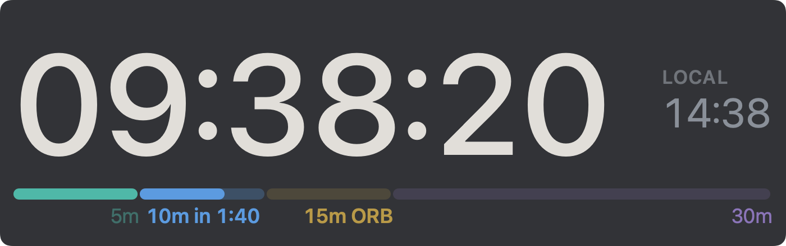

# Trading Clock

A small, native macOS clock for New York session traders. It floats above every
window, including full-screen charts, resizes to whatever corner you give it, and
knows the NYSE day: it changes colour with the session, rings a soft bell at each
boundary, and walks the opening range with a stage bar and a calm voice.



- **Always New York time**, DST handled, with your local time tiny beside it.
- **Session colours.** Slate blue in pre-market (04:00), warm white during regular
  hours (09:30), amber after-hours (16:00), dim grey when closed (20:00).
- **Four bells**, each a different contour so you know which one rang: pre-market
  open, the open, the close, the after-hours close.
- **Opening range bar.** From 09:30 a bar under the clock fills through 5, 10, 15
  and 30 minutes, each stage its own colour, with a countdown to the next one. A
  soft tick and a short phrase mark each stage ("Fifteen minute range set").
- **Session line** the rest of the day: "Pre-market", "Open", "After-hours", "Closed",
  with a note when the day is unusual: "Closed · Thanksgiving Day", "Open · Early
  close 13:00". A countdown to the next boundary can replace it in Settings.
- **Calendar built in.** NYSE holidays and 13:00 early closes are computed from the
  exchange rules, so nothing needs updating each year. Unscheduled closures can be
  pulled from Polygon.io with a free key, or added by hand.
- **Stays out of the way.** Never takes focus from the chart, optional click-through,
  adjustable opacity, on every Space. No Dock icon; a menu bar clock holds the menu.
- **Private.** No account, no telemetry. The only network call is the optional
  calendar check, and only if you paste a key.

## Install

Requirements: macOS 14 or later, Xcode or the Command Line Tools.

```bash
git clone https://github.com/laldinsoft/trading-clock.git
cd trading-clock
make install        # builds dist/Trading Clock.app and copies it to /Applications
```

Open **Trading Clock** from Applications. The clock appears top-right; a clock icon
appears in the menu bar. From that menu (or a right-click on the clock) you can
mute, toggle click-through, open Settings, test every sound, simulate any event
ten seconds before it happens, and turn on Launch at Login.

`make build ARCH=host` is quicker while developing; `make run` builds and launches.

## Using it

| Action | How |
|---|---|
| Move | drag anywhere on the clock |
| Resize | drag a side or a corner |
| Menu | right-click the clock, or the menu bar icon |
| Mute / click-through | ⌘M / ⌘T from the menu |
| Preview a transition | Simulate ▸ 10 s before … |

Settings let you choose, per event, whether it chimes and whether it speaks. By
default every event chimes, and only the open and the four range stages speak.

### Calendar overrides

Two optional layers sit on top of the rule-based NYSE calendar:

1. **Online check.** Paste a free [Polygon.io](https://polygon.io) key in Settings.
   The app fetches upcoming closures and early closes at launch and every six
   hours, and keeps the last result on disk for offline launches.
2. **Manual file.** `~/Library/Application Support/TradingClock/calendar-overrides.json`:

   ```json
   { "closed": ["2026-10-05"], "earlyClose": ["2026-10-09"], "open": [] }
   ```

   `open` forces a day open when a rule or the feed says otherwise.

## Layout

| Path | What |
|---|---|
| `Sources/TradingClockCore` | Pure logic: NYSE calendar rules, session phases, events, range stages, Polygon parser. Unit-tested. |
| `Sources/TradingClock` | The app: floating panel, SwiftUI clock view, sounds, settings, menu, calendar sync. |
| `Tests` | `swift test` |
| `Resources/Sounds` | The chimes, 44.1 kHz mono WAV, peaks at -14 dBFS. |
| `Resources/Speech` | The spoken phrases, peaks at -16 dBFS. |
| `sounds/` | How the audio is made: SuperCollider pieces and `render.sh` for the chimes, `speak.sh` for the phrases. |
| `scripts/` | `build.sh` assembles and signs the app; `screenshot.sh` captures the live window. |

### Sounds

The chimes are synthesised, not sampled: one soft bell and one wooden tick, rendered
headlessly by SuperCollider (`sounds/render.sh`, needs SuperCollider.app and ffmpeg).
The four session bells share a timbre and differ by contour: one mid note, two rising,
two falling, one low and long. The range stages go tick, tick-tick, tick + bell,
tick + lower bell.

The phrases were rendered once with Gemini TTS through the Laldinsoft studio tooling
(`sounds/speak.sh`) and are committed, so building the app needs no cloud access. If
a speech file is missing the app falls back to the system voice.

### Debug flags

```bash
"dist/Trading Clock.app/Contents/MacOS/TradingClock" --simulate range_15 30       # start 30 s before the 15-minute mark
"dist/Trading Clock.app/Contents/MacOS/TradingClock" --snapshot out.png 700 220  # render the view to a PNG and quit
```

Event keys: `premarket_open`, `market_open`, `range_5`, `range_10`, `range_15`,
`range_30`, `market_close`, `day_close`.

## License

MIT, see [LICENSE](LICENSE).
