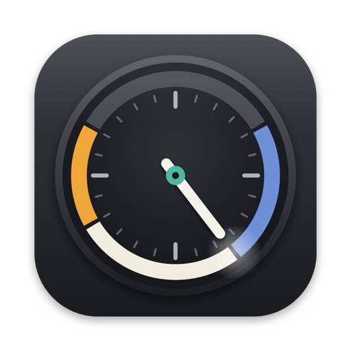
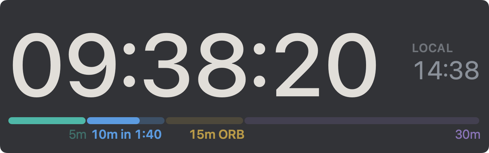
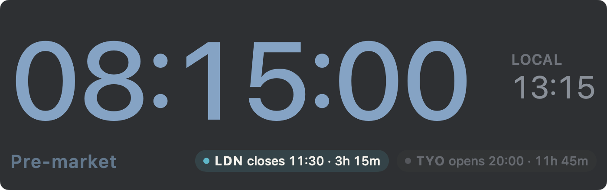

# Trading Clock

[](https://github.com/laldinsoft/trading-clock/actions/workflows/ci.yml)
[](LICENSE)




A small, native macOS clock for New York session traders. It floats above every
window, including full-screen charts, resizes to whatever corner you give it, and
knows the NYSE day: it changes colour with the session, rings a soft bell at each
boundary, walks the opening range with a stage bar and a calm voice, and keeps
an eye on London and Tokyo beside the session line.



- **Always New York time**, DST handled, with your local time tiny beside it.
- **Session colours.** Slate blue in pre-market (04:00), warm white during regular
  hours (09:30), amber after-hours (16:00), dim grey when closed (20:00).
- **Four bells**, each a different contour so you know which one rang: pre-market
  open, the open, the close, the after-hours close.
- **Opening range bar.** From 09:30 a bar under the clock fills through 5, 10, 15
  and 30 minutes, each stage its own colour, with a countdown to the next one. A
  soft tick and a short phrase mark each stage ("Fifteen minute range set").
- **Session line** the rest of the day: "Pre-market", "Open", "After-hours", "Closed",
  with a note when the day is unusual: "Closed · Thanksgiving Day", "Open · Early
  close 13:00". A countdown to the next boundary can replace it in Settings.
- **London and Tokyo at a glance.** Two small chips beside the session line say
  whether each market is open and when that changes, in New York time:
  "LDN closes 11:30 · 3h 15m", "TYO lunch 22:30". Exchange hours, holidays, Tokyo's
  lunch break and the weeks when UK and US clocks disagree are all handled. Either
  chip can be switched off in Settings; both step aside for the opening-range bar.
- **Calendar built in.** NYSE holidays and 13:00 early closes are computed from the
  exchange rules, so nothing needs updating each year. Unscheduled closures can be
  pulled from Polygon.io with a free key, or added by hand.
- **Stays out of the way.** Never takes focus from the chart, optional click-through,
  adjustable opacity, on every Space. No Dock icon; a menu bar clock holds the menu.
- **Private.** No account, no telemetry. The only network calls are the optional
  calendar checks: Polygon.io if you paste a key, and the official UK and Japanese
  holiday lists if you turn that on.



## Download

**[Download Trading Clock for Mac](https://github.com/laldinsoft/trading-clock/releases/latest/download/TradingClock.dmg)** (about 2.3 MB, macOS 14 or later, Apple Silicon or Intel)

1. Open the downloaded `TradingClock.dmg`.
2. Drag **Trading Clock** onto the **Applications** folder in that window.
3. Open Trading Clock from Applications. The clock appears top-right and a clock icon appears in the menu bar.

The download is signed by Laldinsoft Ltd and notarized by Apple, so it opens normally. To update, download the new version and replace the app in Applications. To uninstall, quit it from its menu and move it to the Trash.

## Build from source

Requirements: macOS 14 or later, Xcode or the Command Line Tools.

```bash
git clone https://github.com/laldinsoft/trading-clock.git
cd trading-clock
make install        # builds dist/Trading Clock.app and copies it to /Applications
```

`make build ARCH=host` is quicker while developing; `make run` builds and launches.
See [RELEASING.md](RELEASING.md) for the signed, notarized release process.

## Using it

From the menu bar icon (or a right-click on the clock) you can mute, toggle
click-through, open Settings, test every sound, simulate any event ten seconds
before it happens, tour the whole day in two minutes, and turn on Launch at Login.

| Action | How |
|---|---|
| Move | drag anywhere on the clock |
| Resize | drag a side or a corner |
| Menu | right-click the clock, or the menu bar icon |
| Mute / click-through | ⌘M / ⌘T from the menu |
| Preview a transition | Simulate ▸ 10 s before … |

Settings let you choose, per event, whether it chimes and whether it speaks. By
default every event chimes, and only the open and the four range stages speak.

### Calendar overrides

Optional layers sit on top of the rule-based calendars:

1. **Online check.** Paste a free [Polygon.io](https://polygon.io) key in Settings.
   The app fetches upcoming closures and early closes at launch and every six
   hours, and keeps the last result on disk for offline launches.
2. **Manual file.** `~/Library/Application Support/TradingClock/calendar-overrides.json`:

   ```json
   { "closed": ["2026-10-05"], "earlyClose": ["2026-10-09"], "open": [] }
   ```

   `open` forces a day open when a rule or the feed says otherwise.

   London and Tokyo take the same three lists inside their own objects. `earlyClose`
   means a 12:30 close in London and the morning session only in Tokyo:

   ```json
   { "closed": [], "london": { "closed": ["2027-06-04"] }, "tokyo": { "earlyClose": ["2027-12-30"] } }
   ```

3. **Official UK and Japanese lists.** Settings ▸ World markets ▸ *Check official
   holiday lists daily* reads [GOV.UK's bank holidays](https://www.gov.uk/bank-holidays.json)
   and the [Japanese Cabinet Office's holiday list](https://www8.cao.go.jp/chosei/shukujitsu/syukujitsu.csv).
   No key is needed. For every year a list covers it replaces the rules, which is
   how one-off days such as a coronation or a moved bank holiday get in. Manual
   entries still win. Polygon.io (now Massive) only lists US exchanges, so it
   can't do this.

## Layout

| Path | What |
|---|---|
| `Sources/TradingClockCore` | Pure logic: NYSE calendar rules, session phases, events, range stages, London and Tokyo hours and holidays, Polygon parser. Unit-tested. |
| `Sources/TradingClock` | The app: floating panel, SwiftUI clock view, sounds, settings, menu, calendar sync. |
| `Tests` | `swift test` |
| `Resources/Sounds` | The chimes, 44.1 kHz mono WAV, peaks at -14 dBFS. |
| `Resources/Speech` | The spoken phrases, peaks at -16 dBFS. |
| `sounds/` | How the audio is made: SuperCollider pieces and `render.sh` for the chimes, `speak.sh` for the phrases. |
| `icon/` | `make-icon.swift` draws the icon in code; `build-icns.sh` (`make icon`) packs `Resources/AppIcon.icns`. |
| `scripts/` | `build.sh` assembles and signs the app; `screenshot.sh` captures the live window. |

### Sounds

The chimes are synthesised, not sampled: one soft bell and one wooden tick, rendered
headlessly by SuperCollider (`sounds/render.sh`, needs SuperCollider.app and ffmpeg).
The four session bells share a timbre and differ by contour: one mid note, two rising,
two falling, one low and long. The range stages go tick, tick-tick, tick + bell,
tick + lower bell.

The phrases were rendered once with Gemini TTS through the Laldinsoft studio tooling
(`sounds/speak.sh`) and are committed, so building the app needs no cloud access. If
a speech file is missing the app falls back to the system voice.

### Debug flags

```bash
"dist/Trading Clock.app/Contents/MacOS/TradingClock" --simulate range_15 30       # start 30 s before the 15-minute mark
"dist/Trading Clock.app/Contents/MacOS/TradingClock" --snapshot out.png 700 220  # render the view to a PNG and quit
```

Event keys: `premarket_open`, `market_open`, `range_5`, `range_10`, `range_15`,
`range_30`, `market_close`, `day_close`.

## License

MIT, see [LICENSE](LICENSE).
